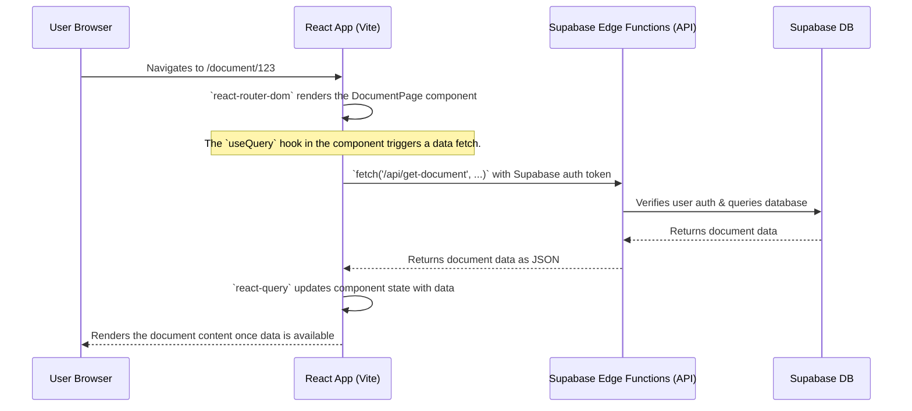

# Askleo Application Architecture (Vite + React SPA)

This document outlines the architectural plan for building the Askleo application as a **Single-Page Application (SPA)** using Vite, React, and TypeScript. This approach differs significantly from a full-stack framework like Next.js, as it requires a clear separation between the frontend application and the backend logic.

Our backend will be powered by **Supabase Edge Functions**, which will serve as the API layer for our client-side React application.

## Core Architectural Changes

1.  **Client-Side Routing**: All page navigation will be handled on the client side by `react-router-dom`. The concept of file-based routing is replaced with an explicitly defined set of routes.
2.  **Explicit API Layer**: All server-side logic (AI analysis, database queries, etc.) will be migrated from Next.js Server Actions to individual Supabase Edge Functions. The React app will communicate with these functions via standard `fetch` API calls.
3.  **Client-Side Data Fetching**: Data fetching and state management (caching, loading states, error handling) will be managed within the React app, ideally using a library like `@tanstack/react-query`.
4.  **No Server Components**: All React components will be standard client-side components. The `"use server"` directive no longer applies.
5.  **Environment Variables**: All environment variables exposed to the frontend must be prefixed with `VITE_` (e.g., `VITE_SUPABASE_URL`).

## New Application Flow (Data Loading Example)

This diagram illustrates how a protected page will fetch its data in the new SPA architecture.



## Detailed Implementation Plan

### 1. Project Structure

The codebase will be organized into two distinct parts: the `frontend` application and the `supabase` backend services.

```
/
|-- frontend/           # The Vite + React SPA
|   |-- src/
|   |   |-- components/ # Reusable UI components (EnhancedEditor, etc.)
|   |   |-- hooks/      # Custom hooks (e.g., useAuth.ts)
|   |   |-- pages/      # Route components (DocumentPage.tsx, etc.)
|   |   |-- services/   # API call helpers (api.ts)
|   |   |-- App.tsx     # Main application component with router setup
|   |   |-- main.tsx    # Application entry point
|
|-- supabase/
|   |-- functions/
|   |   |-- get-document/
|   |   |   |-- index.ts
|   |   |-- analyze-text/
|   |   |   |-- index.ts
|   |   |-- # ... other edge functions
```

### 2. Frontend Application (`frontend/`)

-   **Routing (`App.tsx`)**:
    We will use `react-router-dom` to define all application routes. Protected routes will be wrapped in a layout or component that checks for an active user session.

    ```tsx
    // frontend/src/App.tsx
    import { BrowserRouter, Routes, Route, Navigate } from "react-router-dom";
    import { AuthProvider, useAuth } from "./hooks/useAuth";
    
    function ProtectedRoute({ children }) {
      const { user, isLoading } = useAuth();
      if (isLoading) return <div>Loading...</div>; // Prevent flicker
      return user ? children : <Navigate to="/login" replace />;
    }

    export default function App() {
      return (
        <AuthProvider>
          <BrowserRouter>
            <Routes>
              <Route path="/login" element={<LoginPage />} />
              <Route path="/" element={<ProtectedRoute><DocumentPage /></ProtectedRoute>} />
              {/* ... other routes */}
            </Routes>
          </BrowserRouter>
        </AuthProvider>
      );
    }
    ```

-   **Authentication (`hooks/useAuth.ts`)**:
    Authentication state will be managed in a global React Context. This `AuthProvider` will wrap the entire app, subscribe to Supabase's `onAuthStateChange` event, and provide the user session and loading state to all child components.

-   **Data Fetching (`pages/DocumentPage.tsx`)**:
    Page components will be responsible for fetching their own data. Using `@tanstack/react-query` is highly recommended for this.

    ```tsx
    // frontend/src/pages/DocumentPage.tsx
    import { useQuery } from "@tanstack/react-query";
    import { api } from "../services/api"; // A helper for API calls
    
    export default function DocumentPage() {
      const { id } = useParams();
      const { data: document, isLoading, error } = useQuery({
        queryKey: ["document", id],
        queryFn: () => api.getDocument(id),
      });

      if (isLoading) return <div>Loading document...</div>;
      if (error) return <div>Error: {error.message}</div>;

      return <EnhancedEditor initialDocument={document} />;
    }
    ```

-   **UI Components (`components/`)**: The core visual components (`EnhancedEditor`, `DocumentSidebar`, etc.) from the original project can be reused with minimal changes. The primary difference is that they will now receive their data as props from parent page components that handle the data fetching.

### 3. Backend API (`supabase/functions/`)

Each Next.js Server Action will be converted into a corresponding Supabase Edge Function.

-   **Function Structure (`analyze-text/index.ts`)**:
    Each function is a Deno server. It must handle CORS, authenticate the user, perform its specific task, and return a JSON response.

    ```typescript
    // supabase/functions/analyze-text/index.ts
    import { serve } from "https://deno.land/std/http/server.ts";
    import { createClient } from "https://esm.sh/@supabase/supabase-js";

    // Standard Deno serve function with CORS headers
    serve(async (req) => {
      // 1. Handle preflight CORS requests
      if (req.method === "OPTIONS") {
        return new Response("ok", { headers: { "Access-Control-Allow-Origin": "*", "Access-Control-Allow-Headers": "authorization, x-client-info, apikey" } });
      }

      try {
        // 2. Create a Supabase admin client to authenticate the user
        const supabase = createClient(
          Deno.env.get("SUPABASE_URL")!,
          Deno.env.get("SUPABASE_ANON_KEY")!,
          { global: { headers: { Authorization: req.headers.get("Authorization")! } } }
        );

        // 3. Verify user session from the Authorization header
        const { data: { user } } = await supabase.auth.getUser();
        if (!user) {
          return new Response(JSON.stringify({ error: "Unauthorized" }), { status: 401 });
        }

        // 4. Perform the core logic of the function
        const { text } = await req.json();
        // ... analysis logic calls OpenAI, etc. ...
        
        // 5. Return the result
        return new Response(JSON.stringify({ suggestions }), {
          headers: { "Content-Type": "application/json", "Access-Control-Allow-Origin": "*" },
        });

      } catch (error) {
        return new Response(JSON.stringify({ error: error.message }), { status: 500 });
      }
    });
    ```

### Architectural Trade-offs

-   **Benefits**:
    -   **Clear Separation of Concerns**: The frontend and backend are completely decoupled, allowing them to be developed, deployed, and scaled independently.
    -   **Framework Agnostic**: The Supabase Edge Function API is not tied to a specific frontend and could be consumed by other clients (e.g., a mobile app).
-   **Trade-offs**:
    -   **Increased Complexity**: We now have to manage two separate deployments (the Vite app and the Supabase functions). We must also explicitly handle API state (loading, errors, caching) on the client side, a task that Next.js Server Components largely automated.
    -   **Loss of Server Component Advantages**: We lose the ability to seamlessly fetch data on the server and render a complete HTML page on the initial load. Every data-dependent view in our SPA will require a loading state.
