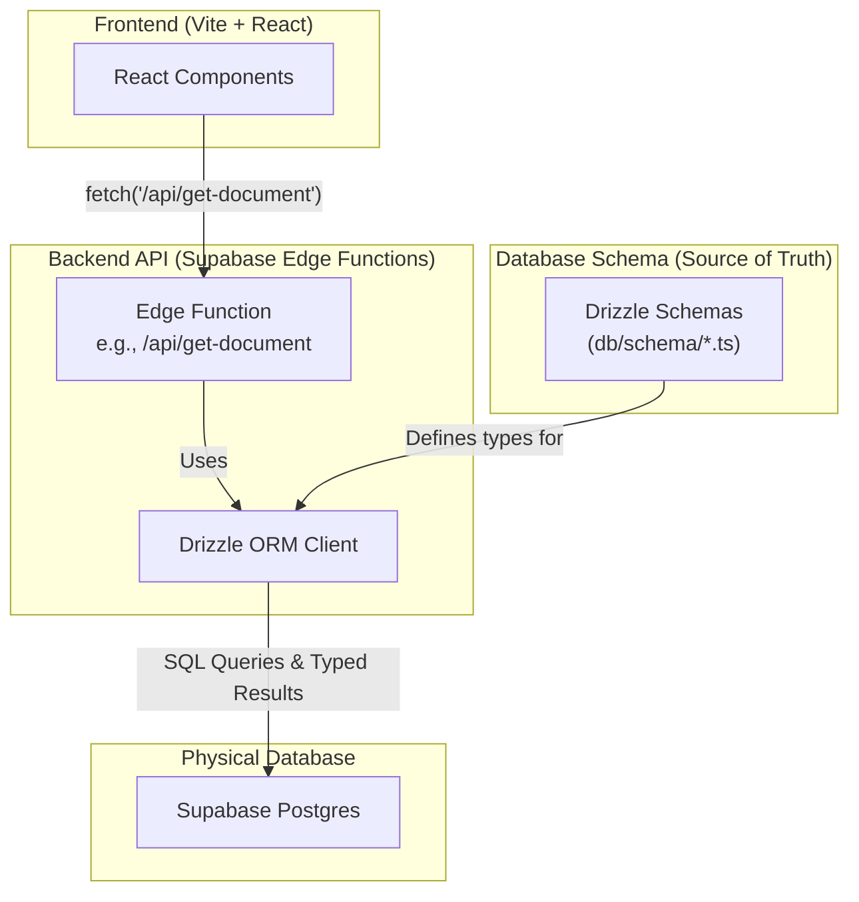

# Drizzle ORM in the Askleo SPA Architecture

This document provides a detailed explanation of how and why Drizzle ORM is used in the Askleo project, specifically within the new Vite + React + Supabase Edge Functions architecture.

## Why Drizzle Remains the Right Choice

Even without a Next.js backend, Drizzle remains the ideal ORM for this project for several key reasons:

1.  **Type Safety**: This is still the primary benefit. Drizzle allows you to define your database schema in TypeScript and then use those types within your Supabase Edge Functions, ensuring that all database interactions are fully type-safe.
2.  **Performance**: Drizzle is a lightweight query builder that generates raw SQL. This is perfect for the Deno runtime of Supabase Edge Functions, as it adds minimal overhead and keeps the functions fast and efficient.
3.  **SQL-like Syntax**: Its intuitive, SQL-like syntax makes it easy to write even complex queries within your backend functions.
4.  **Excellent TypeScript Integration**: Being a TypeScript-first ORM, its integration into the Deno/TypeScript environment of Supabase Functions is seamless.
5.  **Drizzle Kit for Migrations**: The `drizzle-kit` CLI tool remains essential for managing database schema migrations. The process of defining schemas in code and generating SQL files does not change.

## How Drizzle Works in the New Architecture

In the new SPA architecture, Drizzle's role is now exclusively confined to the **backend API layer** (Supabase Edge Functions). It is the type-safe gateway between your API logic and the Supabase Postgres database. The frontend React application never interacts with Drizzle directly.

This diagram illustrates the updated architecture:

### Key Workflows

#### 1. Development: Schema & Migrations

This workflow remains identical to the previous architecture. A developer's local machine is the source of truth for schema changes.

1.  **Schema Definition (`db/schema/*.ts`)**: You continue to define your database tables in TypeScript files using Drizzle's syntax.
2.  **Migration Generation**: From your local machine, you run `pnpm run db:generate`. Drizzle Kit compares your schemas to the cloud database and generates the necessary SQL migration files.
3.  **Applying Migrations**: You run `pnpm run db:migrate` to apply the generated SQL files to your Supabase Postgres database.

#### 2. Runtime: Querying the Database within an Edge Function

This workflow describes how the backend API uses Drizzle to interact with the database.

1.  **API Call**: The frontend React app makes a `fetch` request to a Supabase Edge Function (e.g., `/api/get-document`).
2.  **Edge Function Execution**: The Deno runtime starts the `/api/get-document` function.
3.  **Drizzle Query**: Inside the Edge Function, you initialize a Drizzle client and use its query builder to construct a database query. For example: `db.select().from(documentsTable).where(eq(documentsTable.id, documentId))`. This code is fully type-checked against your Drizzle schemas.
4.  **Execution & Type Safety**: The Drizzle client generates raw SQL, sends it to the Postgres database, and receives the response. It then parses this response into a perfectly typed TypeScript object (`SelectDocument`).
5.  **JSON Response**: The Edge Function takes the type-safe Drizzle result and sends it back to the frontend application as a JSON response.

This architecture ensures that even though the frontend and backend are decoupled, the backend's interactions with the database remain robust, performant, and, most importantly, fully type-safe.
