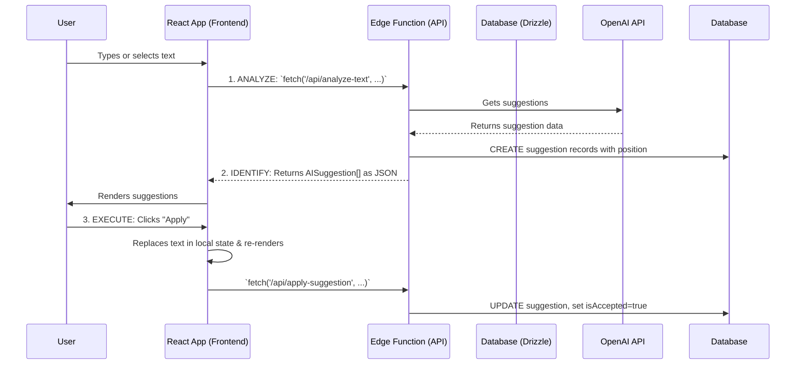
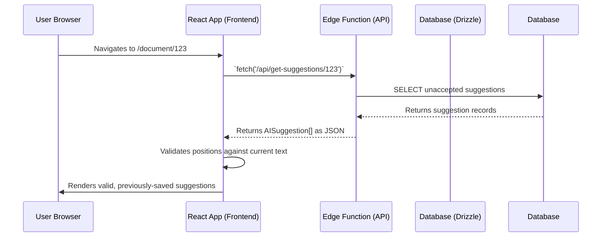

# The Askleo Text Replacement Methodology (Vite + SPA Architecture)

This document breaks down the exact methodology for text replacement in the new Vite + React SPA architecture. The core logic remains robust, but the communication between the frontend and backend is now handled via explicit API calls to Supabase Edge Functions.

## The Core Problem: Ambiguity and Impermanence

The two fundamental challenges remain the same:
1.  **Ambiguity**: Reliably identifying the correct instance of a word or phrase to replace.
2.  **Impermanence**: Persisting suggestions across browser sessions and page reloads.

The solution still relies on **contextual validation**, **precise position tracking**, and a **database-backed persistence layer**, but the implementation is adapted for a decoupled frontend and backend.

## The Two Core Workflows in a SPA

### Workflow 1: Creating New Suggestions

The frontend triggers an API call, and the backend handles analysis and storage.

### Workflow 2: Loading an Existing Document

When a user loads a document, the frontend fetches its saved suggestions from the API.

### Step 1: ANALYZE & STORE - The Backend Edge Function

This logic now lives in a Supabase Edge Function (e.g., `/analyze-text`).

1.  **API Call**: The React frontend makes a `fetch` request to the Edge Function, sending the document text in the request body.
2.  **Authentication**: The Edge Function first validates the user's JWT from the `Authorization` header to ensure they are authenticated.
3.  **Contextual Prompt & Span Identification**: The function calls the OpenAI API, requesting `context` with the suggestions. It then uses the `findTextSpan` logic to determine the precise `start` and `end` character positions.
4.  **Store in Database**: Using a Drizzle client, the function calls `createSuggestionAction` to write the new, positioned suggestion to the `suggestions` table in the database.
5.  **Return to Frontend**: The function returns the array of fully-formed `AISuggestion` objects (with their unique IDs and spans) to the frontend as a JSON response.

### Step 2: EXECUTE & TRACK - Applying Suggestions on the Frontend

This client-side logic in `EnhancedEditor.tsx` remains very similar conceptually.

1.  **Local Replacement**: The editor replaces the text in its local state (`contentRef.current`) and re-renders the highlighted view.
2.  **Track in Database via API**: After the local change, the editor makes a `fetch` request to another Edge Function (e.g., `/apply-suggestion`). This function finds the suggestion in the database and updates its `isAccepted` flag to `true`.

### Step 3: RELOAD & RE-VALIDATE - The Persistence Layer in a SPA

This is the key to resilience across sessions.

1.  **Fetch on Load**: When a page component like `DocumentPage` mounts, it uses a data-fetching hook (like `useQuery`) to call an Edge Function (e.g., `/get-suggestions/:documentId`).
2.  **Validate Positions**: The frontend receives this list of saved suggestions. It then performs the same critical validation: does the text at the saved `startPosition` and `endPosition` still match the suggestion's `originalText`?
3.  **Find New Position or Discard**: If the position is no longer valid (due to user edits), the `findNewPosition` logic attempts to locate the text elsewhere. If it can't be found, the suggestion is discarded from the client-side state for that session.

## Core Package Dependencies

This architecture relies on these key packages:

1.  **`@supabase/supabase-js`**: The core library for interacting with Supabase from both the frontend (auth, API calls) and the backend Edge Functions.
2.  **`react`** & **`react-dom`**: The foundation for the entire frontend application and its state management.
3.  **`drizzle-orm`** & Deno-compatible **`postgres`** driver: Used exclusively within the Supabase Edge Functions for all database interactions.
4.  **`openai`**: Used exclusively within the Edge Functions to communicate with the OpenAI API.
5.  **`@tanstack/react-query`** (Recommended): While not strictly required, a data-fetching library like this is essential in a SPA for managing API loading states, errors, and caching, simplifying the logic in page components.
6.  **`react-router-dom`**: Manages all client-side routing and navigation.
