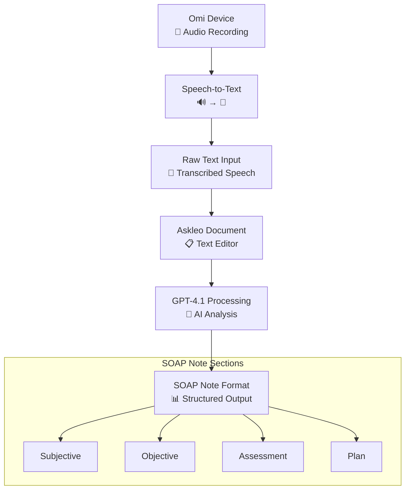

# Askleo - AI-Powered Medical Documentation Assistant

**Named after Asclepius, the Greek god of healing.**

Askleo is an intelligent medical writing assistant designed to solve one of the biggest pain points in healthcare: writing accurate, efficient medical documentation like SOAP notes and other clinical documents.

## 1. The Problem

Medical professionals waste countless hours writing documentation when they could be focusing on patient care. Traditional medical note-taking:
- Slows down clinical workflows
- Requires mastering complex shorthand systems
- Often leads to incomplete or inaccurate documentation
- Takes time away from life-saving activities

As the creator experienced during mass casualty coordination: "I always felt like note taking always slowed me down... I genuinely believe I could have saved more lives at a 1.5x increased rate" with better tools.

## 2. The Solution

Askleo combines cutting-edge AI technology to revolutionize medical documentation:

- **Medical Dictionary Libraries**: Ensures clinical accuracy and proper medical terminology.
- **GPT-Powered Analysis**: Provides real-time checking and intelligent suggestions for improvements.
- **SOAP Formatting**: Offers specialized templates and formatting for medical documentation standards.
- **Coming Soon: Omi Integration**: Will enable speech-to-text dictation for hands-free note creation.

### Workflow with Omi Integration

The future-state workflow is designed for maximum efficiency in a clinical setting, moving from voice to a structured note seamlessly.

## 3. Core Features

### Real-Time Writing Assistance
- Intelligent grammar, spelling, and style suggestions.
- Medical terminology validation.
- SOAP note structure guidance.
- Live document analysis and improvements via a WebSocket connection.

### Document Management
- Create and manage SOAP notes, research documents, and EHR addendums.
- A professional, clean interface designed for medical-grade work.
- Secure document storage and retrieval powered by Supabase.
- Version history and auto-save functionality.

### AI-Powered Suggestions
- Context-aware suggestions tailored for medical writing.
- Rule-based corrections for grammar, spelling, and style.
- Clear explanations for each suggested improvement to aid in learning and decision-making.

## 4. Target Users

Askleo is designed for a wide range of healthcare professionals:

- **Medical Doctors**: To streamline clinical documentation.
- **Nurses**: For efficient and accurate patient care notes.
- **Medical Researchers**: To assist with academic and clinical research documentation.
- **Medical Scribes**: To enhance and speed up their documentation workflows.
- **Emergency Responders**: For rapid and accurate incident documentation in high-stress environments.

## 5. Future Vision

- **Omi Device Integration**: Hands-free, speech-to-text dictation.
- **Advanced Medical Templates**: Specialized formats for different medical fields.
- **Team Collaboration**: Features for sharing and collaborating on medical documents.
- **Mobile Application**: On-the-go documentation for field medical work.

---

***"Saving time on documentation to save more lives."***
