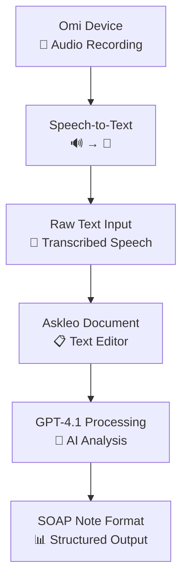

# Askleo - Technical Summary

This document provides a high-level technical overview of the Askleo application, an AI-powered medical documentation assistant designed for healthcare professionals.

## 1. System Architecture

### Core Technologies
- **Frontend**: React with TypeScript, styled with Tailwind CSS for a professional, clinical interface.
- **Backend**: A high-performance Fastify API server responsible for business logic and WebSocket connections.
- **AI Engine**: OpenAI GPT-4.1 for real-time analysis and intelligent medical writing suggestions.
- **Authentication**: Supabase Auth for secure user management.
- **Database**: Supabase (PostgreSQL) for all data storage, including documents, suggestions, and user profiles.
- **Real-time Communication**: WebSockets for instant communication between the frontend and the Fastify backend.
- **Infrastructure**: Deployed on Fly.io for global availability and reliability.
- **Package Manager**: Bun for fast and efficient dependency management and script execution.

## 2. Key Workflows & Components

### Omi Speech-to-Text Workflow (Future)
The core workflow is designed for maximum efficiency, starting with hands-free dictation.

### Text Processing & Editor System
- **Foundation**: A real-time, rich-text editor tailored for medical documentation.
- **Medical Terminology**: Integrates with medical dictionary libraries to validate and suggest correct clinical terms.
- **SOAP Formatting**: Provides specialized templates and validation to ensure documents adhere to the SOAP (Subjective, Objective, Assessment, Plan) note standard.
- **Real-time Analysis**: Utilizes a WebSocket connection to the Fastify backend for instant analysis as the professional types, without waiting for a debounce or pause.

### AI Suggestion Engine
- **Types of Analysis**:
  - Grammar, spelling, and style corrections.
  - Medical terminology validation and suggestions.
  - Structural recommendations for SOAP note sections.
- **Explanations**: Each suggestion is accompanied by a clear rationale to assist in decision-making.

### Document Management
- **Storage**: All documents (SOAP notes, research, etc.) are securely stored in the Supabase database.
- **Functionality**: Features include version history, auto-save, and organization tools for efficient retrieval.

### Database Schema
- **Core Tables**:
  - `profiles`: Stores user data, linked directly to Supabase Auth.
  - `documents`: Stores medical documents, with columns for content and structured data like SOAP sections.
  - `suggestions`: Caches AI-generated suggestions to persist them across sessions and track user interactions.
- **Security**: Utilizes Supabase's Row Level Security (RLS) to ensure a user can only access their own documents.

## 3. Integration Points

- **Authentication & Database**: Supabase serves as the unified backend for user auth and data persistence.
- **AI Analysis**: The Fastify backend communicates directly with the OpenAI API.
- **Real-time Layer**: WebSockets connect the React frontend directly to the Fastify backend for live suggestions.
- **Speech-to-Text**: The future Omi device integration will provide the initial text input for the system.

## 4. Technical & Performance Specifications

- **Real-time Communication**: Suggestions and analysis are delivered over a persistent WebSocket connection to minimize latency.
- **Scalability**: The decoupled frontend (Vite/React) and backend (Fastify) are deployed on Fly.io, allowing them to be scaled independently based on demand.
- **Security**: Authentication is handled via JWTs managed by Supabase. All API communication between the frontend and backend is secured.
- **Data Integrity**: The database schema is designed with foreign key constraints and cascade deletes to ensure data consistency, especially when users or documents are removed.
