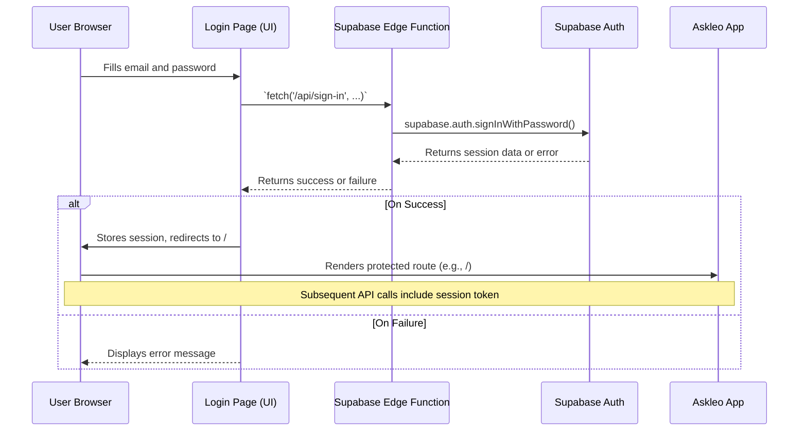

# New Authentication Architecture with Supabase

This document outlines a thorough, clear, and concise plan for how to architect the Askleo authentication system from scratch using Supabase Auth. This approach simplifies the stack, improves data integrity, and gives you full control over the user experience.

---

## Core Architectural Changes

The fundamental shift is moving from an external authentication provider (Clerk) to an integrated one. Supabase Auth lives alongside your database, which eliminates the need for webhook-based synchronization and simplifies data relationships.

1.  **Direct Database Integration**: The `profiles` table will have a direct, one-to-one foreign key relationship with Supabase's built-in `auth.users` table. This is more robust and efficient than webhook synchronization.
2.  **Custom UI Components**: We will build our own UI components for login, signup, and other auth-related pages.
3.  **Server-Side Auth Logic**: All authentication logic (signing in, signing up, signing out) will be handled in **Server Actions**, which securely call the Supabase Auth client on the backend.
4.  **Simplified Middleware**: The `middleware.ts` file will be updated to use the Supabase JS library to check for a valid user session from the request's cookies.

## New Authentication Flow (Sign-In Example)

This diagram illustrates the new end-to-end flow for a user signing in within the SPA architecture.



## Detailed Component-by-Component Implementation Plan

Here is how each part of the application would be built to support this new architecture:

### 1. Environment Variables (`.env.local`)

You would simplify your environment variables in your Vite project.

**Remove:**
-   `NEXT_PUBLIC_CLERK_PUBLISHABLE_KEY`
-   `CLERK_SECRET_KEY`

**Keep/Ensure (prefixed with `VITE_`):**
-   `VITE_SUPABASE_URL`
-   `VITE_SUPABASE_ANON_KEY`

### 2. Database Schema (`db/schema/profiles-schema.ts`)

This remains a critical improvement. The `profiles` table will have a direct foreign key constraint to the `auth.users` table in Supabase.

```typescript
// db/schema/profiles-schema.ts

import { pgTable, text, timestamp, uuid } from "drizzle-orm/pg-core";
import { auth } from "./auth-schema"; // A new helper schema

export const profilesTable = pgTable("profiles", {
  // This ID now directly references the user ID from Supabase's auth system.
  id: uuid("id").primaryKey().references(() => auth.users.id, { onDelete: "cascade" }),
  email: text("email").notNull().unique(),
  name: text("name"),
  // ... other profile fields like membership, stripeCustomerId, etc.
});

// A new helper file would be created: db/schema/auth-schema.ts
// This file simply defines the shape of Supabase's built-in auth tables
// so that Drizzle can use it for relational queries.
import { pgTable, uuid, timestamp } from "drizzle-orm/pg-core";

export const auth = {
  users: pgTable("users", {
    id: uuid("id").primaryKey(),
    // ... other auth.users columns
  }, { schema: "auth" })
};
```
This creates a true relational link and removes any possibility of data being out of sync.

### 3. Authentication API (`supabase/functions/`)

You will create dedicated Supabase Edge Functions for all authentication logic. This keeps your secrets on the server.

```typescript
// supabase/functions/sign-in/index.ts
// Similar functions would exist for sign-up and sign-out

import { serve } from "https://deno.land/std/http/server.ts";
import { createClient } from "https://esm.sh/@supabase/supabase-js";

serve(async (req) => {
  const supabase = createClient(Deno.env.get("SUPABASE_URL")!, Deno.env.get("SUPABASE_ANON_KEY")!);
  const { email, password } = await req.json();
  const { data, error } = await supabase.auth.signInWithPassword({ email, password });

  if (error) {
    return new Response(JSON.stringify({ error: error.message }), { status: 401 });
  }

  return new Response(JSON.stringify(data), { headers: { "Content-Type": "application/json" } });
});
```

### 4. Authentication UI (`frontend/src/pages/`)

The auth pages will be standard React components that use `fetch` to call the Supabase Edge Functions.

```tsx
// frontend/src/pages/LoginPage.tsx
import { useState } from "react";
import { useAuth } from "../hooks/useAuth";

export default function LoginPage() {
  const { signIn } = useAuth();
  const [error, setError] = useState<string | null>(null);

  const handleSubmit = async (e) => {
    e.preventDefault();
    const formData = new FormData(e.currentTarget);
    const email = formData.get("email") as string;
    const password = formData.get("password") as string;
    
    const { error } = await signIn(email, password);
    if (error) setError(error.message);
  };

  return (
    <form onSubmit={handleSubmit}>
      {/* ... form inputs for email and password ... */}
      {error && <p>{error}</p>}
      <button type="submit">Sign In</button>
    </form>
  );
}
```

### 5. Route Protection

Route protection will be handled entirely on the client-side using `react-router-dom` and a custom auth context.

```tsx
// frontend/src/App.tsx
import { AuthProvider, useAuth } from "./hooks/useAuth";
import { BrowserRouter, Routes, Route, Navigate } from "react-router-dom";

function ProtectedRoute({ children }) {
  const { user, isLoading } = useAuth();
  if (isLoading) return <div>Loading...</div>;
  return user ? children : <Navigate to="/login" replace />;
}

// ... rest of App component setup ...
```

### 6. Accessing User Data

-   **Backend**: In any Supabase Edge Function, you can get the current user by creating an admin Supabase client and validating the JWT from the request's `Authorization` header.
-   **Client-Side**: A global `AuthProvider` context will subscribe to Supabase's `onAuthStateChange` event. This will make the user session available to all components via a `useAuth()` hook, avoiding the need for extra network requests on page navigation.

## Summary of Benefits of this New Architecture

-   **Simplicity**: You manage users in the same place as the rest of your data.
-   **Data Integrity**: Using a real foreign key relationship between `profiles` and `auth.users` guarantees data consistency.
-   **Reduced Dependencies**: You remove Clerk as an external dependency, simplifying your stack.
-   **Full Control & Framework Agnostic**: You have complete control over the auth UI and the backend API can be used by any frontend client.

---

## Core Package Dependencies

This authentication architecture relies on a few key packages to function correctly:

1.  **`@supabase/supabase-js`**:
    *   **How it's used**: This is the core JavaScript library for interacting with Supabase from both the client-side (for auth events) and the server-side (in Edge Functions).

2.  **`react`** and **`react-dom`**:
    *   **How they're used**: Used to build the custom UI components for the login, sign-up, and other authentication-related pages.

3.  **`react-router-dom`**:
    *   **How it's used**: Manages all client-side routing, including the logic for protected routes.
