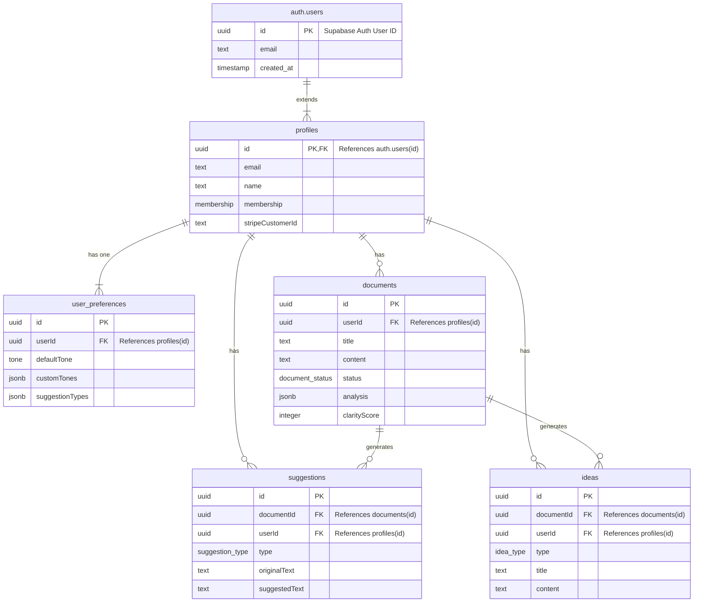

# Askleo Database Architecture (with Supabase Auth)

This document provides a detailed overview of the Askleo database structure, which is built on PostgreSQL and managed via Supabase. The schema is defined using Drizzle ORM and is tightly integrated with Supabase's built-in Authentication service.

## Core Architectural Principle

Unlike the previous architecture that synchronized with an external service (Clerk), this new design uses Supabase Auth as the single source of truth for user identity. The application's `profiles` table now has a direct foreign key relationship to the `auth.users` table, ensuring data integrity and simplifying the overall system.

## Entity-Relationship Diagram (ERD)

The following diagram illustrates the relationships between the core tables. It explicitly shows the new `auth.users` table (which is managed by Supabase) and its direct relationship to the application's `profiles` table.

## Table Breakdown

Here is a detailed explanation of each table's purpose within the new architecture.

### `auth.users` (Built-in Supabase Table)
-   **Purpose**: This is the master table for user authentication, managed automatically by Supabase. It is the single source of truth for a user's identity, email, and authentication status.
-   **Key Column**:
    -   `id` (uuid): The unique identifier for each user, generated by Supabase Auth upon sign-up.

### `profiles`
-   **Purpose**: This table **extends** the `auth.users` table to store application-specific data related to a user. It holds information that is not directly related to authentication, such as subscription status and billing details.
-   **Primary Key & Foreign Key**: `id` (uuid) - This is the most critical change. The `id` column is now both the primary key for the `profiles` table and a **foreign key** that directly references the `id` from the `auth.users` table.
-   **Key Columns**:
    -   `membership`: An `enum` (`free` or `pro`) to track the user's subscription level.
    -   `stripeCustomerId`: The user's unique ID from Stripe, essential for managing billing.

### `user_preferences`
-   **Purpose**: Holds user-specific settings to customize the application experience.
-   **Relationship**: Has a one-to-one relationship with the `profiles` table via the `userId` column.

### `documents`
-   **Purpose**: Stores all the text documents created by users.
-   **Relationship**: Each document is directly linked to a user via the `userId` foreign key, which references the `profiles` table.

### `suggestions`
-   **Purpose**: Caches AI-generated writing suggestions for specific documents to avoid re-running analysis and to persist them across user sessions.
-   **Relationship**: Each suggestion is linked to both a `document` and a `user`. The relationship with the `documents` table is set to **cascade on delete**.

### `ideas`
-   **Purpose**: Stores AI-generated content ideas, such as headlines, topics, and outlines.
-   **Relationship**: Linked to both `documents` and `users`, also with cascade on delete from the document.

## Data Integrity and Cascade Deletes

This new architecture provides a significant advantage in data integrity. By setting `onDelete: "cascade"` in the `profiles` schema, the following automated cleanup process is established:

1.  A user decides to delete their account.
2.  Their record is deleted from the `auth.users` table via a Supabase function.
3.  Because of the foreign key relationship, the corresponding row in the `profiles` table is **automatically deleted**.
4.  Because tables like `documents` and `suggestions` have a cascaded relationship with `profiles`, all of that user's documents, suggestions, and ideas are also **automatically and instantly deleted**.

This ensures there are no orphaned records in the database, simplifying data management and enhancing user privacy.

---

## Core Package Dependencies

The database architecture is built upon a few essential packages that enable the connection, schema definition, and migration processes:

1.  **`drizzle-orm`**:
    *   **How it's used**: This is the core TypeScript ORM. It's used to define the database schema in a type-safe way (e.g., `profilesTable`, `documentsTable`) and to build SQL queries within the Supabase Edge Functions with full type-safety.

2.  **`drizzle-kit`**:
    *   **How it's used**: This is a command-line tool used during development. It compares the Drizzle schema definitions in your code to the actual state of the Supabase database and automatically generates the `.sql` migration files needed to keep them in sync. It is invoked via the `pnpm run db:migrate` command.

3.  **`postgres`**:
    *   **How it's used**: This is the high-performance PostgreSQL client (database driver) for Node.js. In the context of Supabase Edge Functions, you would use a Deno-compatible Postgres driver. Drizzle uses this package under the hood to execute the generated SQL queries against your Supabase database.
